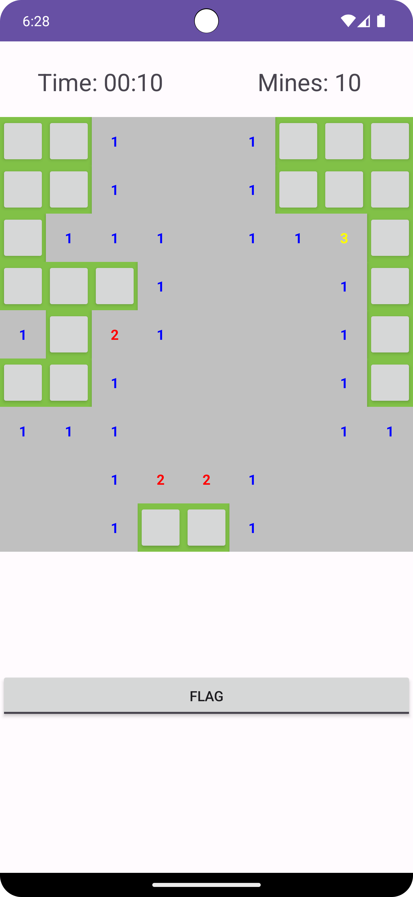
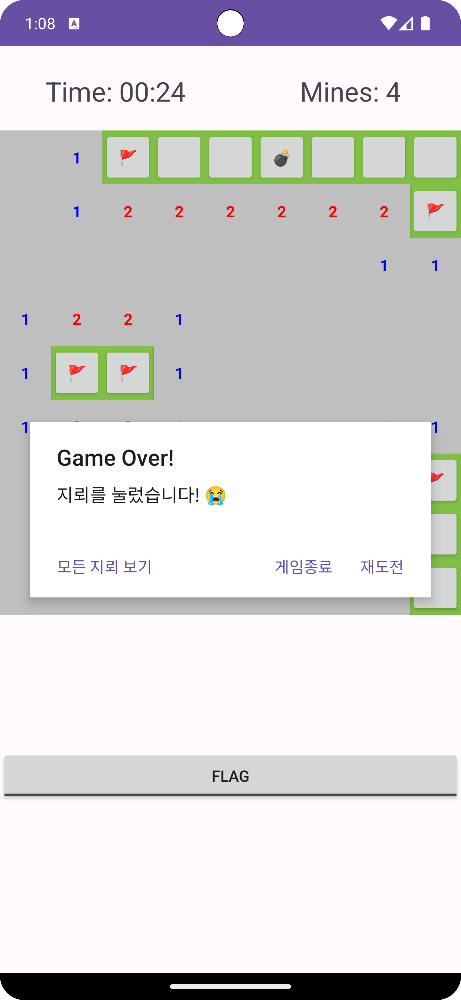
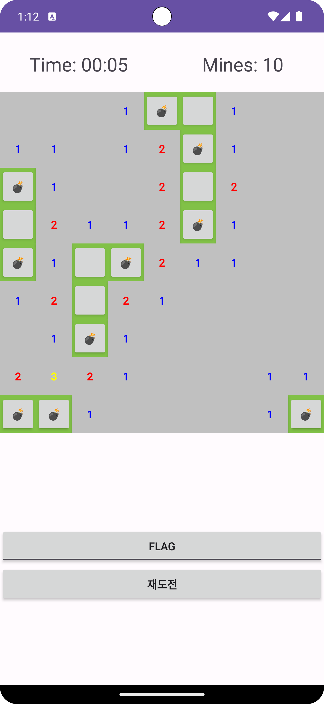
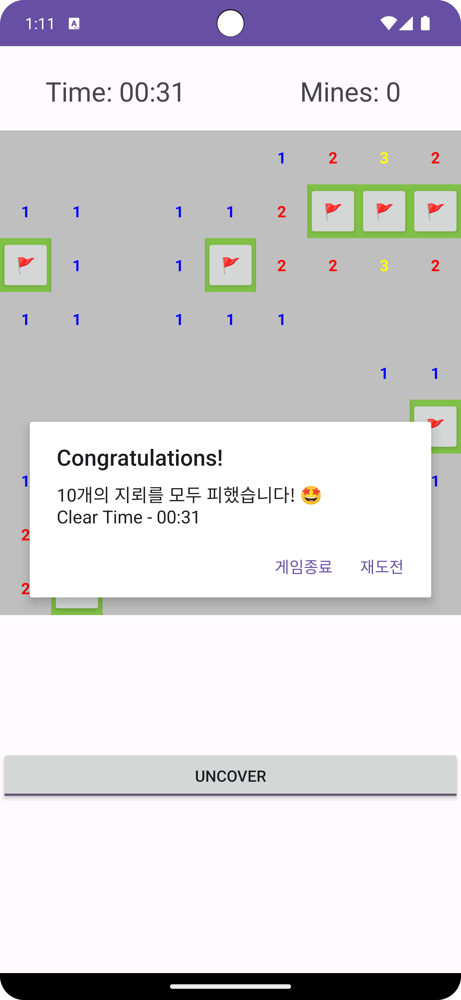

  
  <h1>Minesweeper Android App</h1>
  
  

    본 프로젝트는 경기대학교 2023학년도 2학기 모바일프로그래밍(DD731)를 수강 중에 개발한 지뢰찾기게임 안드로이드 앱 입니다.
  

  
  

 
  

<!-- About the Project -->
## :star2: About the Project

<!-- Screenshots -->
### :camera: Screenshots

|   Game Playing   |   Defeat   |  Show All Mine   |  Win   |
| :------: | :---------: | :--------------: | :--------------: |
|  |  |  |  |
|   게임 플레이 도중입니다   |   지뢰를 클릭하면  패배 메시지가 뜹니다   |  패배한 후 모든 지뢰 위치를  확인해 볼 수 있습니다.   |  모든 지뢰를 피해서 블록을  다 깨면 승리 메시지가 뜹니다   |

<!-- TechStack -->
### 📃: Tech Stack
|   Java   |   Android   |  AndroidStudio   |
| :------: | :---------: | :--------------: |
|   |  |  |

<!-- Features -->
### :dart: Features

- 9x9 사이즈의 81개 블록중에서 10개의 지뢰를 피해 나머지 블록을 모두 찾으면 승리!
- 그 전에 지뢰를 클릭하면 패배!
- 게임 플레이 도중에 하단의 토글버튼을 통해서 깃발모드로 전환 후 지뢰가 의심되는 블록위치에 깃발 세우기 가능
- 게임이 시작되면 자동으로 타이머 실행
- 게임에서 패배하게 되면 10개의 지뢰 위치를 확인할 수 있음

<!-- Roadmap -->
## :compass: Roadmap

* [x] Todo 1
* [x] Todo 2
